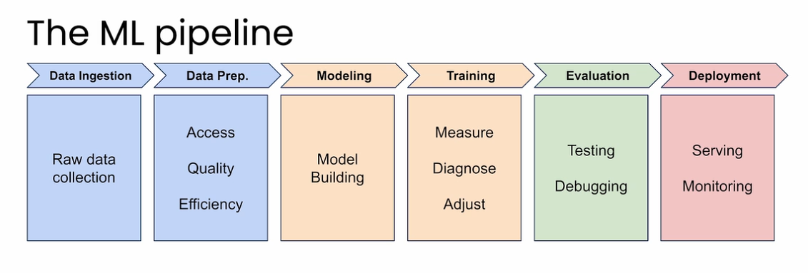

# Why PyTorch?
### 🚀 1. Pythonic & Easy to Learn
- Feels like writing **pure Python code**
- Minimal abstraction → easier debugging and experimentation
- Works naturally with Python tools like `numpy`, `matplotlib`

> 🧠 PyTorch = "write code like you think"
### ⚡ 2. Dynamic Computation Graph (Define-by-Run)
- Graph is created **on the fly during execution**
- More flexible than TensorFlow (especially older TF versions)
#### ✅ Advantages:
- Easier debugging (use standard Python debugging tools)
- Better for:
  - Research
  - NLP (variable-length inputs)
  - Reinforcement Learning
### 🔬 3. Research-Friendly
- Widely used in academia and cutting-edge AI research
- Most new papers release **PyTorch implementations first**
> 📚 If you're reading research papers → PyTorch is usually the default
### 🧰 4. Strong Ecosystem
- Key libraries:
  - `torchvision` → computer vision
  - `torchaudio` → audio processing
  - `torchtext` → NLP
- Hugging Face Transformers integrates seamlessly with PyTorch
### 🐞 5. Easier Debugging
- Since it's dynamic:
  - Errors happen exactly where they occur
  - No need to inspect static graphs

### ⚙️ 6. Flexibility > Boilerplate
- TensorFlow (especially older versions) required:
  - Graph definition + session execution
- PyTorch:
  - Just write and run

```python
# PyTorch style
y = model(x)
loss = criterion(y, target)
loss.backward()
```

# The ML Pipeline


### 📥 Data Ingestion  
- Collect raw data from various sources (databases, APIs, sensors, logs)  
- Ensure data is stored in a usable and scalable format  
- Focus on gathering **relevant and sufficient data**  
  
---  
  
### 🧹 Data Preparation  
- Clean and preprocess data (handle missing values, outliers)  
- Transform data (normalization, encoding categorical variables)  
- Ensure:  
- **Access** → data is available  
- **Quality** → data is accurate and consistent  
- **Efficiency** → optimized for training  
  
---  
  
### 🧠 Modeling  
- Choose appropriate model architecture (e.g., linear models, CNNs, transformers)  
- Define features and target variables  
- Build the model using frameworks like PyTorch  
  
---  
  
### 🏋️ Training  
- Train model on data using loss functions and optimizers  
- Iteratively:  
- **Measure** performance (loss, metrics)  
- **Diagnose** issues (overfitting, underfitting)  
- **Adjust** hyperparameters or architecture  
  
---  
  
### 🧪 Evaluation  
- Test model on unseen data (validation/test sets)  
- Perform:  
- **Testing** → check generalization  
- **Debugging** → analyze errors and failure cases  
  
---  
  
### 🚀 Deployment  
- Serve model in production (API, app, service)  
- Monitor performance over time:  
- **Serving** → make predictions in real-time or batch  
- **Monitoring** → detect drift, degradation, failures

# Building Neural Networks


## Data Ingestion & Data Prep

```python
inputs = torch.tensor([[1.0], [2.0], [3.0], [4.0]], dtype=torch.float32)
times = torch.tensor([[6.96], [12.11], [16.77], [22.21]], dtype=torch.float32)
```

--- 
## Model Building

``` python
model = nn.Sequential(nn.Linear(1,1))
loss_function = nn.MSELoss()
optimizer = optim.SGD(model.parameters(), lr=0.01)
```
* **Loss Function:** <code>nn.[MSELoss](https://pytorch.org/docs/stable/generated/torch.nn.MSELoss.html)</code> defines the Mean Squared Error loss function.
    * It measures how wrong your predictions are. If you predict 25 minutes but the actual delivery took 30 minutes, the loss function quantifies that 5-minute error. The model's goal is to minimize this error.
* **Optimizer:** <code>[optim](https://pytorch.org/docs/stable/optim.html).[SGD](https://pytorch.org/docs/stable/generated/torch.optim.SGD.html)</code> sets up the Stochastic Gradient Descent optimizer. It adjusts your model's weight and bias parameters based on the errors.
    * `lr=0.01`: This learning rate controls how big each adjustment step is. Too large and you might overshoot the best values; too small and training takes forever.
---

## Training

``` python
for epoch in range(500):
	optimizer.zero_grad() #it clears out all of the calculated values ​from the previous training round.
	outputs = model(inputs)
	loss = loss_function(outputs, times)
	loss.backward() # figures how to update w & b (backpropagation)
	optimizer.step() # updates the model's parameters
	
```
**Inference**
``` python
with torch.no_grad():
	test_distance - torch.tensor([[25.0]], dtype=torch.float32)
	predicted_time = model(test_distance)
	print(predicte_time.item())
```
**Inspecting Model's Learning**
```python
# Access the first (and only) layer in the sequential model
layer = model[0]

# Get weights and bias
weights = layer.weight.data.numpy()
bias = layer.bias.data.numpy()

print(f"Weight: {weights}")
print(f"Bias: {bias}")
```

# 🧠 From Linear Models to Neural Networks (with ReLU)

### 📌 Key Idea
- A **single neuron (linear model)** can only learn **straight-line relationships**
- Even stacking multiple neurons *without activation functions* still results in a **linear model**

> ❗ Linear operations + linear combinations = still linear → cannot model real-world complexity

---

### 🔑 Why Non-Linearity is Needed
- Real-world patterns (like traffic, pricing, etc.) are **nonlinear (curved)**
- To capture these, we introduce **activation functions**
- These functions transform outputs in a **nonlinear way**

---

### ⚡ Activation Functions
- Applied after each neuron’s linear computation
- Enable models to learn **complex patterns and decision boundaries**
- Common ones:
  - **ReLU** → most widely used
  - Sigmoid, Tanh → used in specific cases
    

---

### 🔥 ReLU (Rectified Linear Unit)
- Simple rule:
  - If input < 0 → output = 0  
  - If input ≥ 0 → output = input
- Adds a **“bend”** to the model → breaks linearity

#### 💡 Insight:
- Each neuron with ReLU introduces **one bend (kink)** in the function
- Bend location depends on weights and bias

---

### 🧩 Building Complexity with Multiple Neurons
- Each neuron:
  - Learns a different **activation point**
  - Contributes a piece of the overall shape
- Combining multiple neurons:
  - Creates **multiple bends**
  - Approximates **complex curves**

> 🧠 More neurons → more flexibility → better approximation of real-world patterns

---

### 🏗️ Neural Network Structure (Concept)
- **Input layer** → receives data
- **Hidden layer(s)** → multiple neurons + activation (ReLU)
- **Output layer** → combines results into final prediction

---

### 🎯 Why This Matters
- Without activation → model is too simple (underfits)
- With activation + multiple neurons → model can:
  - Learn **nonlinear relationships**
  - Approximate **almost any function** (given enough neurons)

---

### 🏁 Summary
- Linear models are limited to straight lines  
- Activation functions (like ReLU) introduce nonlinearity  
- Multiple neurons + ReLU = ability to model complex, real-world patterns  
- This is the foundation of **modern neural networks and deep learning**
## Normalization

```python
# Calculate the mean and standard deviation for the 'distances' tensor
distances_mean = distances.mean()
distances_std = distances.std()

# Calculate the mean and standard deviation for the 'times' tensor
times_mean = times.mean()
times_std = times.std()

# Apply standardization to the distances.
distances_norm = (distances - distances_mean) / distances_std

# Apply standardization to the times.
times_norm = (times - times_mean) / times_std
```

---

# What are Tensors?

- First dimension is the batch size
```python
x = torch.tensor([[1.0], [2.0], [3.0]])
print(x.shape)  # torch.Size([3, 1])
````

> ❗ Most common errors = shape mismatches

---

### 🔢 2. Data Types (dtype)

- Default:
    
    - `int` → `int64`
        
    - `float` → `float32`  

```python
x = torch.tensor([1, 2, 3], dtype=torch.float32)
x = x.float()  # convert
```

---

### 🏗️ 3. Creating Tensors

```python
# from list
x = torch.tensor([1.0, 2.0])

# from NumPy (shared memory!)
x = torch.from_numpy(np.array([1.0, 2.0]))

# common patterns
torch.zeros(3, 1)
torch.ones(3, 1)
torch.rand(3, 1)
```

---

### 🔄 4. Reshaping (Fixing Inputs)

- Models expect batch dimension

```python
x = torch.tensor(25.0)

x = x.unsqueeze(0).unsqueeze(1)  # shape → [1, 1]
x = x.squeeze()  # remove dims of size 1
```

---

### ✂️ 5. Indexing & Slicing

```python
x = torch.tensor([[1.0], [2.0], [3.0]])

x[0]        # first element (still tensor)
x[:2]       # first two
x[0].item() # Python value (only for 1 element)
```

---

### 🎯 Why This Matters

- Shapes → match model inputs
    
- dtypes → avoid silent bugs
    
- reshaping → fix single vs batch inputs
    
- indexing → inspect outputs
    

 ``print(x.shape)

`` x = torch.tensor([1, 2, 3])
`` print("TENSOR DATA TYPE:", x.dtype)

``` python
df = pd.read_csv('./data.csv')

# Extract the data as a NumPy array from the DataFrame
all_values = df.values

# Convert the DataFrame's values to a PyTorch tensor
tensor_from_df = torch.tensor(all_values)

print("ORIGINAL DATAFRAME:\n\n", df)
print("\nRESULTING TENSOR:\n\n", tensor_from_df)
print("\nTENSOR DATA TYPE:", tensor_from_df.dtype)
```
`` zeros = torch.zeros(2, 3)
`` ones = torch.ones(2, 3)
`` random = torch.rand(2, 3)
`` range_tensor = torch.arange(0, 10, step=1)

- Concatenate two tensors `` concatenated_tensors = torch.cat((tensor_a, tensor_b), dim=1)
- `torch.mean()`: Calculates the mean of all elements in a tensor.
- `torch.std()`: Calculates the standard deviation of all elements.

