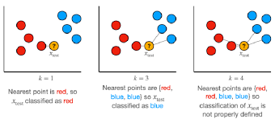

# K-Nearest Neighbors (KNN)

**Type:** Supervised | Classification & Regression  
**Family:** Instance-Based / Non-Parametric Models  
**Core Idea:** Predict based on the labels of the closest data points  

---

## 📌 Definition
K-Nearest Neighbors (KNN) is a non-parametric supervised learning algorithm that classifies or predicts the value of a data point based on the majority label (or average) of its k nearest neighbors in the feature space.



---

## 🧠 Intuition
Think of KNN as “you are what your neighbors are.”

To classify a new point, look at the closest K data points around it and assign the most common label.  
For regression, take the average of the neighbors' values.

---

## ⚙️ How It Works (Step-by-step)
- Step 1: Choose the number of neighbors (K)  
- Step 2: Compute distance between query point and all training points  
- Step 3: Select K nearest neighbors  
- Step 4:  
  - Classification → majority vote  
  - Regression → average value  
- Step 5: Assign prediction  

---

## 🧮 Mathematics

- Distance Metric (Euclidean):

$$
d(x, x_i) = \sqrt{\sum_{j=1}^{n} (x_j - x_{ij})^2}
$$

- Manhattan Distance:

$$
d(x, x_i) = \sum_{j=1}^{n} |x_j - x_{ij}|
$$

- Prediction (Classification):

$$
\hat{y} = \text{mode}(y_1, y_2, ..., y_k)
$$

- Prediction (Regression):

$$
\hat{y} = \frac{1}{k} \sum_{i=1}^{k} y_i
$$

---

## 🔢 Vector / Matrix Form
KNN does not learn explicit parameters, so there is **no fixed weight vector**.

Distance computation can be written as:

$$
d(x, x_i) = ||x - x_i||_2
$$

---

## 🎯 Objective
There is no explicit optimization objective; KNN is a **lazy learner** that stores the dataset and makes predictions at query time.

---

## 📈 When to Use
- Small to medium-sized datasets  
- When decision boundary is non-linear  
- When no assumption about data distribution is desired  
- Pattern recognition tasks  

---

## ⚠️ Limitations
- Computationally expensive at prediction time (O(n))  
- Sensitive to irrelevant features  
- Requires proper feature scaling  
- Performance degrades in high dimensions (curse of dimensionality)  

---

## ⚖️ Bias-Variance Behavior
- Low bias (flexible model)  
- High variance (sensitive to noise)  
- Small K → overfitting  
- Large K → underfitting  

---

## 🔧 Key Hyperparameters
- n_neighbors (K): Number of neighbors  
- metric: Distance function (Euclidean, Manhattan, etc.)  
- weights: Uniform or distance-weighted  

---

## 🔄 Variants / Extensions
- Weighted KNN  
- KD-Tree / Ball Tree (for faster search)  
- Radius-based neighbors  

---

## 🔗 Related Algorithms
- Decision Trees (non-linear boundaries)  
- SVM (distance-based intuition)  
- Clustering (similarity-based grouping)  

---

## 💻 Implementation (Minimal)
```python
from sklearn.neighbors import KNeighborsClassifier

# sample data
X = [[1], [2], [3], [4]]
y = [0, 0, 1, 1]

model = KNeighborsClassifier(n_neighbors=3)
model.fit(X, y)

print(model.predict([[2.5]]))
```
